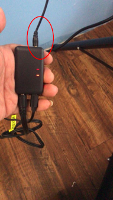
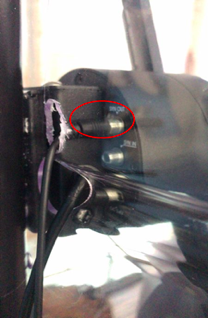

# 手册

## 概述

该模块有两端

顶端红圈处是同步线输入孔

底端是USB供电孔和音频输出孔

> 音频输出线为三段的线：左声道、右声道、地

## 操作指南

### 拷贝音乐

Usb孔可接入usb数据线直接连接电脑，就会出现一个usb硬盘，选择自己喜欢的音乐放到01文件夹目录下。

命名规则：三位数字_名

> （如：征服.mp3  命名为 001_征服.mp3，第一首对应001）该三位数字将对应机器列表播放。

### 机器操作

1. 把MP3模块usb孔接上电源
2. 音频输出孔接入音响（或者功放等设备）
3. 同步线输入孔接入我们的机器同步信号输出孔`syn out`

!!! warning 
    一定要检查线没有接错，避免烧毁模块！

此时，只要控制机器转动，音乐就会播放，调节音量在控制机器的app设置页面。

### 矩阵连接

将最后一台机器同步线插至音乐模块即可

!!! note "准备工作"
    在连接前请将音乐提前拷贝进音乐模块中