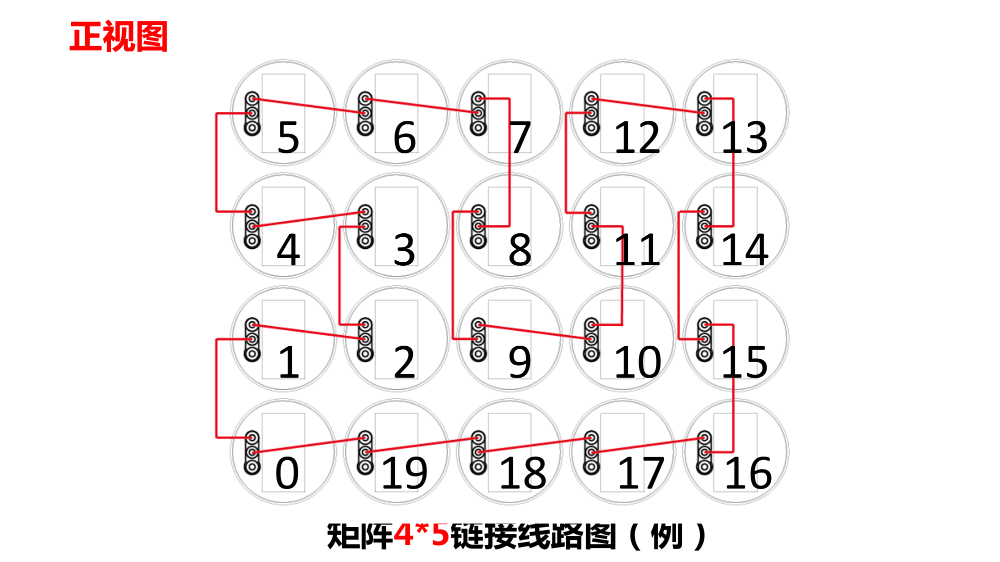

# 矩阵/多机搭建手册

## 安装前

1. 两台设备间最佳距离为`46.4cm`，高低相差`2cm` 
2. 左上角第一台一定为高，即垫高`2cm`
3. 高的设备旁边均为低，高低错落安装，防止触碰 
4. 安装好之后，手动轻轻拨动扇叶，观察是否需要微调位置

### 矩阵同步线连接说明

!!! note "原理"
    A设备输出口连B设备的输入口，B设备的输出口连C 设备的输入口，如此重复下去，形成一个循环

!!! warning "注意"
    1. 如果连接顺序错误，后续步骤很麻烦
    2. 请按顺序连接音频同步线

## 连接示范

!!! danger "危险！"
    1. 运转产品前，请使用手转动一下扇叶，看看是否会互相触碰
    2. 请先把所有的线捆绑好再运转产品，以免造成事故。

## 主从机设定

当进行矩阵拼接时，由于设备过多，难以每台都操控，所以我们会进行主从机设置，由一台主机控制其他从机。 

1. 设备接上电源，长按矩阵上所有设备的`Mode`键 (亮绿灯)
2. 选择`0号机`作为主机，双击`Match`键 (主机亮红灯，从机灯全灭)
3. 此时主机设置完毕

!!! note "紫色提示灯"
    `0号机`亮紫灯，表示设置失败。请到常见问题处排查问题

## 架子示范

[架子组装说明-6台.pdf](documents/架子组装说明-6台.pdf)

[架子组装说明-20台.pdf](documents/架子组装说明-20台.pdf)