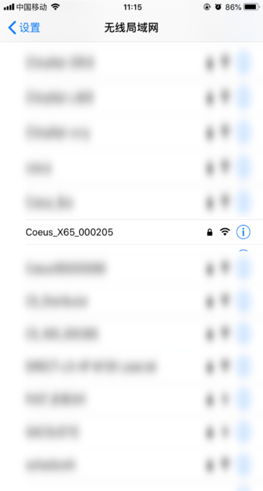
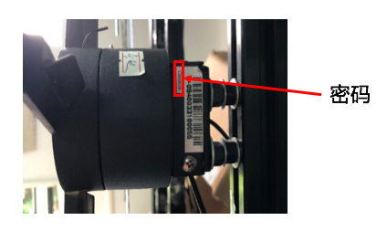
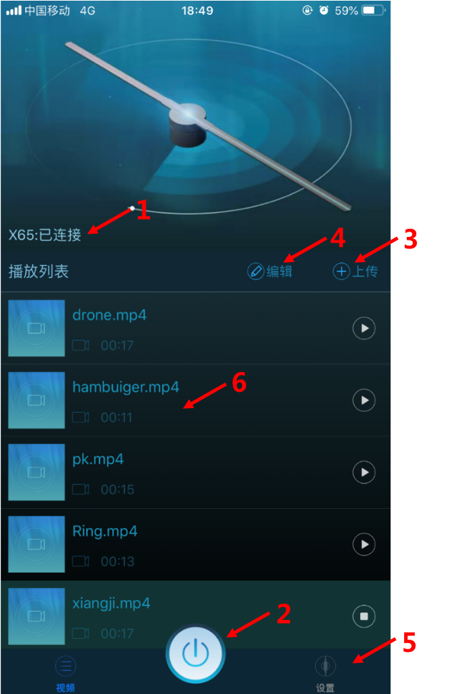
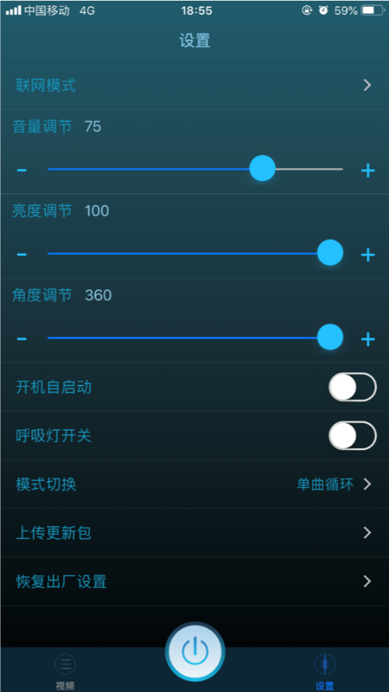
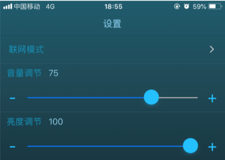
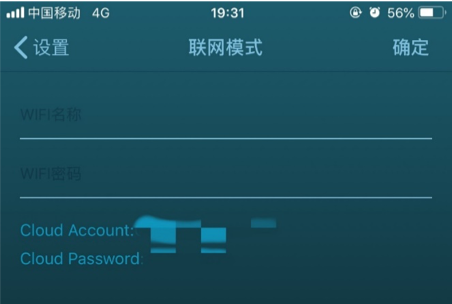

# 手机端手册

## 准备工作

1. 设备上电
2. 打开手机-设置-WiFi 

3. 找到对应WiFi，输入密码后打开APP

!!! warning "无法连接到APP？"
    1. 安卓设备使用前需关闭4G网络，并且允许所有权限，打开定位
    2. 周围无线干扰太多时，请靠近设备进行连接
    3. 设备上电后60s内，可搜索到WiFi，请耐心等待
    4. 设备连接上云端之后，无法使用App控制设备（详情可看云端故障排除）

## App 介绍

1. 显示已连接
2. 开关：控制设备开关
3. 上传：上传视频 
4. 编辑：更改视频命名和顺序 
5. 设置
6. 点击任意视频即播放该视频

!!! danger "文件命名"
        在**上传，编辑文件时**请**不要重复命名**！否则文件会被覆盖

1. 联网模式：用于连接云端
2. 音量调节
3. 亮度调节
4. 角度调节
5. 开机自启动：设备上电是否立即启动
6. 呼吸灯开关：设备关闭时是否显示呼吸灯
7. 模式切换：循环播放、随机播放
8. 上传更新包：下载更新包后进行设备更新
9. 恢复出厂设置：还原所有设置

!!! note "更新软件"
    建议每隔一段时间便更新程序

## 将设备连入云端

1. 手机连接APP
2. 点击联网模式
    
    

3. 输入设备附近的WIFI名称和密码

    

4. 输入后，点击确认
5. 在云端注册设备，请参考[此教程](../cloud/manual)

!!! warning "WiFi连接"
    1. 输入的`WiFi`必须与互联网联通
    2. `5G WiFi`暂不支持，请注意确认设备机型及可使用网络类型

