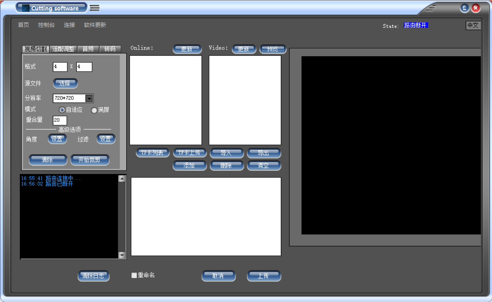
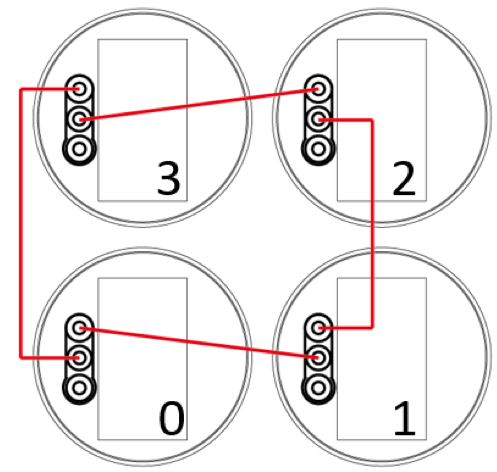

# PC 软件手册

## 整体流程

1. 路由插上电源
2. 矩阵设备插上电源，`60s`后，主机双击`mode`键连接路由
3. 电脑连接WiFi（连上后电脑无网络）
4. 打开软件进行视频切割
5. 视频切割上传完成，双击match键取消连接 

## 主界面

## 视频处理

### 视频切割

- 格式：填入联屏设备数量 `横轴方向上设备数量 X 纵轴方向上设备数量`
- 源文件：选择需要切割的视频
- 分辨率：
    - `X65`选择`720*720`
    - `X50`选择`512*512`
- 模式：默认选择自适应
- 重合量：默认`20`
- 角度：默认不调整
- 过滤：默认不调整

!!! note "重合量"
    `20`是试验最好效果，一般无需修改

!!! note "任务完成"
    `Video 框`出现`总数量 = 输入宽高积`时为切割完成

#### 角度调整

!!! warning "注意"
    一般不使用此功能

    此功能操作难度较高，适用于机器安装位置与安装图纸有较大出入时，采用此功能。

- 点击设置进入角度设置页面

!!! note "参数详解"
    安装在上位的机器称上机，安装在底下位置的机器称为下机。一般上机图像为满圆，下机为一面或多面缺失图像。

!!! note "设备位置"
    - `1-2` 表示，第一横排第二竖排视频位置
    - `3-4` 表示，第三横排第四竖排视频位置。

- 选择需要调整视频位置
    
!!! note "左交角度"
    本机与左侧机器交合角度，如按照图纸严格安装，交合角度为`90`，安装物理距离偏大则交合角度会变小，安装物理距离偏大则交合角度变大。
    
    右交角度、上交角度、下交角度: 同理

    - 若交合角度变小，会使图像向左延申以补充物理距离;若交合角 度变大会使图像向右偏移以适应物理距离。
    - 补充/适应物理距离只需调整下机参数，上机不需要调整;
    - 调整上位机左交角度会使图像偏左或偏右移动，上交角度会使图像偏上或偏下移动。

!!! note "旋转角度"

    使本部分图像向右偏转的角度，该功能主要为了适配机器角度不正，而不影响其他正常工作的联屏视频。

#### 过滤

过滤用来选择视频中哪个部分不显示

### 视频上传

!!! warning "注意"
    以下操作均在矩阵设备连接好，WiFi连接后进行的操作

#### 设备连接示意图

在当前连接情况下：

- 视频`2-1`上传到`0`号设备
- 视频`2-2`上传到`1`号设备
- 视频`1-2`上传到`2`号设备
- 视频`1-1`上传到`3`号设备

#### 路由上传

1. 机器连接上路由盒子后，电脑连接上路由盒子WIFI 
2. 选择在线机器对应视频内容
3. 点击添加到上传列表
4. 选择重命名
5. 点击上传，开始上传
6. 上传完毕

#### TF 卡上传

1. 拆下 TF 卡，并记录 TF 所在位置
3. 打开软件，并电脑连上WIFI.(或通过网线直连)
4. 路由器插入 TF 卡
5. 在软件中选中要上传的视频，点击 TF 卡上传，等待上传完成
6. TF 插回设备
7. 设备重新上电

!!! danger "TF 卡操作"
    必须要断电才能插拔TF 卡！

### 视频适配

适配调整功能应用于源视频与目标联屏矩阵比例不一致时，将视频大小适配到目标大小

1. 选择想要更改大小的视频->右键->属性->详细信息(查看源视频分辨率大小)
2. 输入源视频分辩率原宽、高和目标视频分辨率宽高
3. 输入起始坐标  
    - 居中公式
        - `X = (目标宽-源宽)/2`
        - `Y = (目标高-源高)/2`
4. 选择源文件
5. 点击执行

!!! note "居中公式"
    此公式会使图像居中显示，如需显示其他位置，可根据真实需要调整 XY 值。 XY 为图像显示的坐标。

### 音频提取

1. 选择源文件（需要提取音频的视频）
2. 输入序号
3. 输入重命名
4. 点击提取
5. 生成文件名为排序数字_音频名字.mp3

### 转码

此功能可以将视频格式转为mp4格式，并对视频进行压缩

1. 选择源文件（需要转码的视频）
2. 选择分辨率
3. 输入重命名
4. 点击执行
5. 生成格式为mp4的文件
