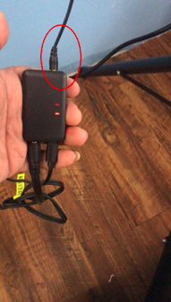

# MP3 Manual

## Overview

This modules has two sides.

The top red circle is for sync line.

The button is for USB line and audio out.

!!! note "Audio out"
    The audio line should have `3` sections: Left channel, Right channel, and Ground Line

## Instructions

### Copy Music

The USB line can connect to computer with a data cable. It will appear as a USB storage devices. 

Copy music to folder named `01`.

filename rules：{three digit}_{name}

> e.g. ：`Lucky.mp3` should renamed to `001_Lucky.mp3`. 
> `001` means it is the first one to play

### Connect

1. Plug in power via USB port
2. Plug in audio line
3. Plug in sync line from the last machine's `syn out` port

!!! warning 
    Please double check the line arrangement!

Now, once the machine is on, the music will be played.

Volumn of the music can be controlled by the APP.

### Multidevice Screen

Connect MP3 module to the last machine of the multidevice screen

!!! note "Preparation"
    Please copy the music into the module before connection.