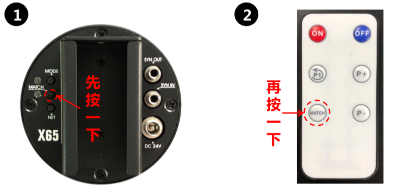

# Remote Control Manual

## Pairing

1. Power on the device and press `Match` button
2. Press `Match` button on the remote control
3. Finish paring

!!! note "Multidevice screen"
    If you want to use remote control over multidevice screen, please only paring with the host machine.