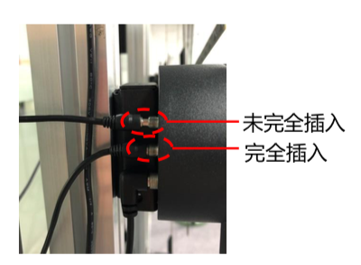

# FAQ

## Purple light on when paring

1. Check if the sync line is fully plugged in
2. Check if the line is connected appropriately
3. The sync line is broken, please contact our technical support

Reconfigure after checking

## Can I use different models to build multidevice screen?

No, you should only use one kind of model once.

please check the manual to see if your device is capable of building multidevice screen.