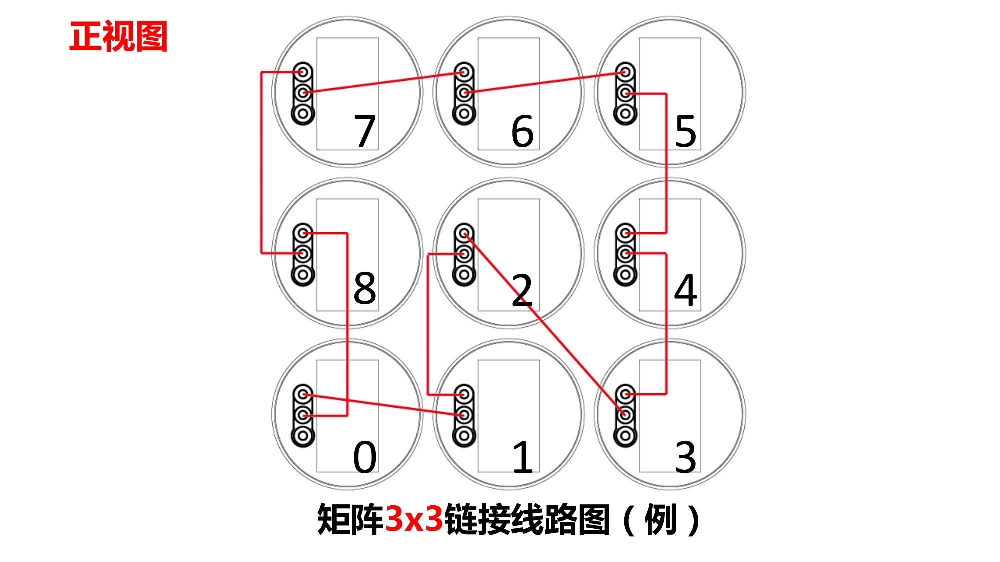

# Multidevice Screen Manual

## Before Installation

1. The preferred distance between two device is `46.4cm`, upper and lower distance is `2cm` 
2. The upper left machine must be the higher one (make that one `2cm` higher than other machine)
3. The higher machine is always beside a lower one. One higher one lower one so that they won't bumped into each other.
4. Toggle the blade to see if further adjustment need to be made

### Sync line

!!! note "How it works"
    Device A Sync out is connected to Device B Sync in, and Device B Sync out is connected to Device C Sync in, and so on.

!!! warning
    1. Please follow the order when connecting sync line
    2. Please follow the order when connecting audio sync line

## Examples

!!! danger
    1. Please toggle the blade and make sure there is no collision before power on!
    2. Please stable all wire before power on

## Master Slave Machine Setting

Since it hard to control each individual device when using the multidevice screen, we use one master device to control all slave devices. 

Please follow the steps to set up master device.

1. Power on the devices and long press all `Mode` button of devices in the multidevice screen
    - Green light will be on
2. Choose Machine `0` as host. Double press the `Match` button
    - host machine will shine red light, and slave machine won't have any light on
3. Setup Finished

!!! note "Machine 0"
    `machine 0` is chose randomly, but usually, upper left one is chosen 

!!! note "Purple light"
    If `machine 0` is shining purple light, please refer to [FAQ](faq).

## Shelf Examples

[架子组装说明-6台.pdf](documents/架子组装说明-6台.pdf)

[架子组装说明-20台.pdf](documents/架子组装说明-20台.pdf)