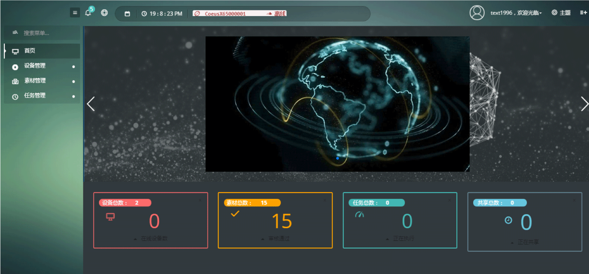
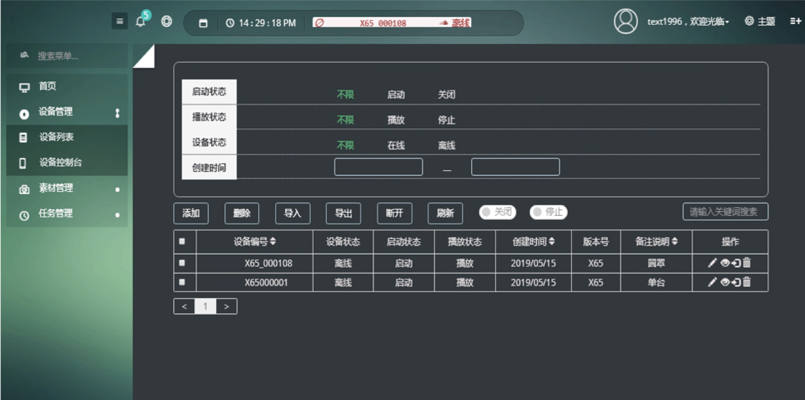
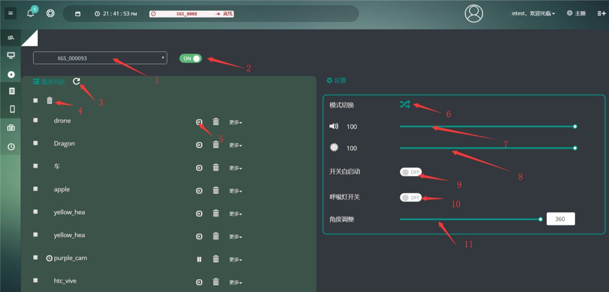
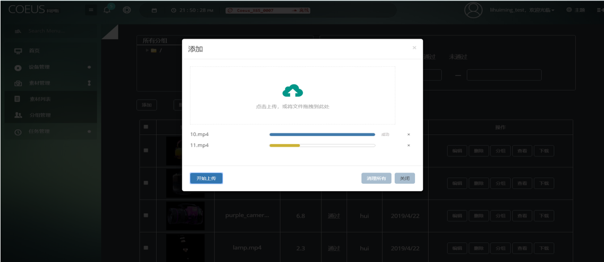
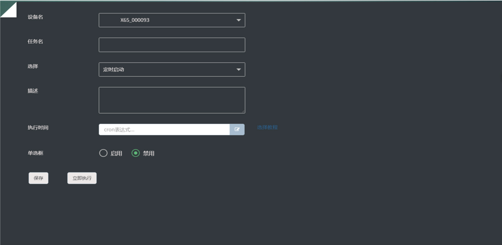
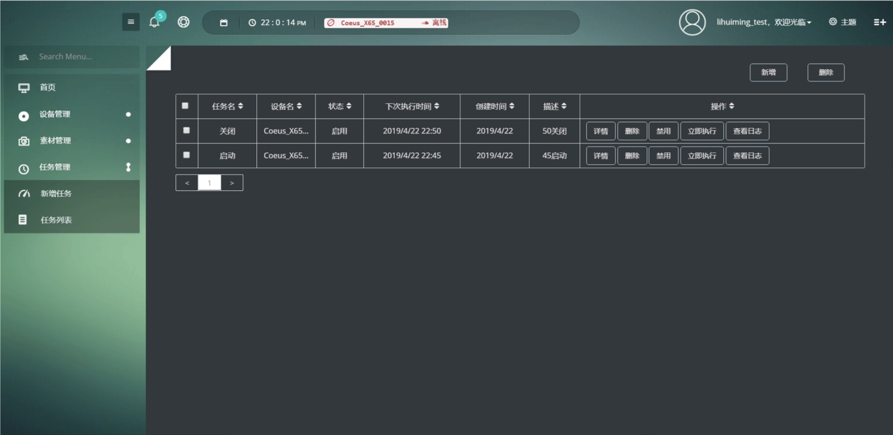

# Cloud Platform Manual

## Main Page

## Device

### Device List

1. Delete Device

    Click the delete button on the list. It also supports batch manipulation.

2. Import/Export List: 
    - Click `Export`, the template file will be available for download
    - Click `Import`, upload a template file to add multiple devices at the same time.
3. Power on/off: 
    - Device will power on/off
    - Device will also be paused
4. Play/Pause Machine
    - Click `Device`
    - Click `Device Control` and choose the device you want to control

!!! warning "Download Material to Device"
    `Download Material to device` need to the material status to be `approved`. 
    Then Click the `Download` button.

    Learn more about how to [upload material](#_7)

### Device Control

1. Choose control device
2. Power on/off
3. Refresh list
4. Delete item
5. Play/Pause
6. Play Mode
7. Volumn
8. Bright
9. Auto Restart
10. Breathing light
11. Angle

## Matieral

### Material Management

1. Add new material：
    - Click `Material Management`
    - `Material List`
    - `Add`
    - Choose a file
    - Uploading
2. Close the floating window, the material will be shown `approving`
3. Wait until the material finished reviewing
4. If the material is `approved`, choose `download to device` and select device to download
4. If the material is downloaded into the device, it will shown on the `device control` panel

## Timed Task

### New Task

Timed task includes：

- Timed on
- Timed off
- Timed play specific material

Time granularity are：minutes, hours, days, months, weeks, and years

Please refers to [this tutorial](https://crontab.guru/) for further instruction.

### Task List

List of current running tasks and their statuses

