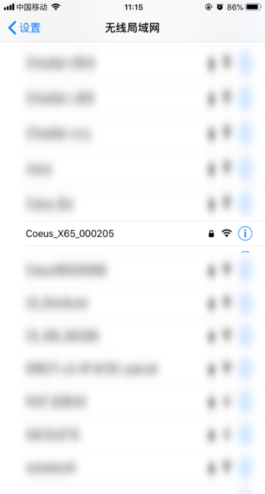
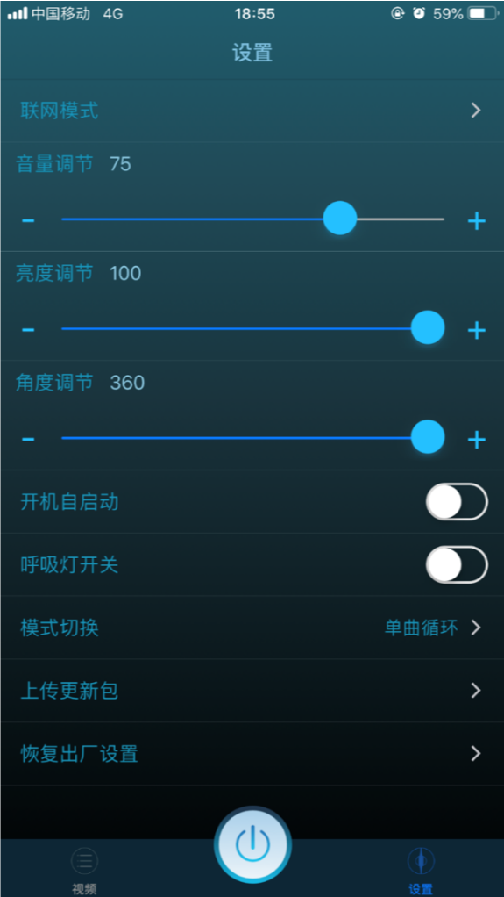

# Mobile Manual

## Preparation

1. Device Power On
2. Goto Device WiFi's setting

    

3. Find the corrospond WiFi and connect

    

!!! warning "Unable to connect to WiFi?"
    1. For Android device: please turn of Cellular mobile data, grant all permission，and turn on location service
    2. If there is too many WiFi: get closer to the device before connecting
    3. Please be patient: WiFi will show up in `60s`
    4. The device you are trying to connect is connecting to the Cloud platform（Check FAQ for further instruction）

## App Intro

1. Connection Status: connected
2. Power on/off
3. Upload video
4. Edit：rename video or reorder video
5. Device Setting
6. Click any video to play on device

!!! danger "rename video"
        When **uploading/editing file name**, **Please DO NOT use the same name for two file**! or the file will be overwrite.

1. Network Mode: used to connect cloud platform
2. Volumn
3. Bright
4. Angle
5. Auto Restart: if the device is plug in, it will automatically power on
6. Breathing Light：Show light when device is power off
7. Mode：Loop, Random, In order
8. Software Update：Download software update and apply
9. Reset：Reset all setting to factory setting

!!! note "Software Update"
    It is highly recommand to update software regularly

## Connect to Cloud Platform

1. Use APP to connect to the device
2. Click `Network Mode`
    
    

3. Enter a WiFI nearby

    

4. Click Confirm
5. Register Device on cloud platform, refer to [this tutorial](../cloud/manual)

!!! warning "WiFi Connection"
    1. `WiFi` must haveInternet connection    
    2. `5G WiFi` is not supported yet，please double check device support network type in the manual

