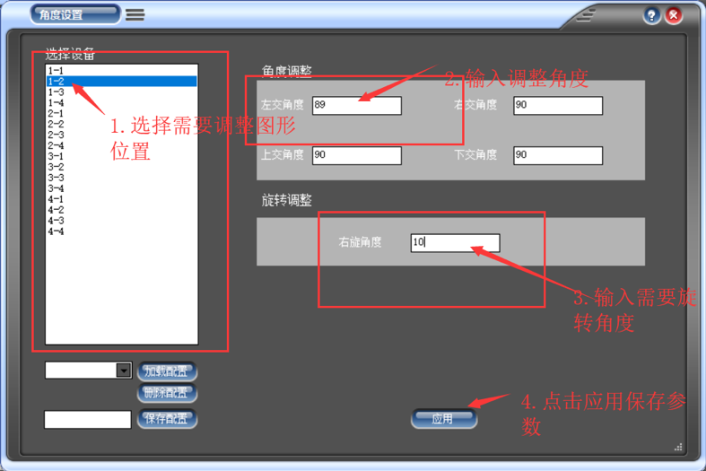

# PC Software Manual

## Overview

1. Power on the router
2. Power on the multidevice screen, double press `mode` key of the host machine after `60s` to connect to the device
3. Let the computer connect to the router
4. Use our PC software to convert the video
5. Use our PC software to upload the video, and double press `mode` key to disconnect from router

!!! warning "Computer"
    The computer won't be able to access Internet via Wireless after connecting to the router

## Main Page

## Video

### Video cutting

- Size: Fill in the number of devices of the multidevice screen 
    - `# of device in horizontal direction` `**X**` `# of devices in vertical direction`
- Source file: Choose which video to cut
- Resolution:
    - For `X65`, please choose `720*720`
    - For `X50`, please choose `512*512`
- Mode: Self-adapt
- Overlay: default `20`
- Angle: leave unchanged
- Filter: leave unchanged

!!! note "Overlay"
    `20` is the best value tested by our company. Please don't change unless you are told to do so.

!!! note "Task Complete!"
    When `Video Table` appears `total number = height x weight`, the task has completed

#### Angle Adjustment

!!! warning
    This function should not be used frequently.

    It is used if the setup is different from the default

- Click Setting

!!! note "Terms"
    安装在上位的机器称上机，安装在底下位置的机器称为下机。一般上机图像为满圆，下机为一面或多面缺失图像。

!!! note "Device Location"
    - `1-2` indicates the first horizontal row, and the second vertical column
    - `3-4` indicates the fourth horizontal row, and the third horizontal column

- 选择需要调整视频位置
    
!!! note "左交角度"
    本机与左侧机器交合角度，如按照图纸严格安装，交合角度为`90`，安装物理距离偏大则交合角度会变小，安装物理距离偏大则交合角度变大。
    
    右交角度、上交角度、下交角度: 同理

    - 若交合角度变小，会使图像向左延申以补充物理距离;若交合角 度变大会使图像向右偏移以适应物理距离。
    - 补充/适应物理距离只需调整下机参数，上机不需要调整;
    - 调整上位机左交角度会使图像偏左或偏右移动，上交角度会使图像偏上或偏下移动。

!!! note "Rotate Angle"

    使本部分图像向右偏转的角度，该功能主要为了适配机器角度不正，而不影响其他正常工作的联屏视频。

#### Filter

Filter is used to choose which part of the video will not appear on the screen.

### Upload Video

!!! warning
    The following steps should only be done after the multidevice screen is on and WiFi is connected.

#### Diagram

Under such conditions：

- video `2-1` should upload to device `0` 
- video `2-2` should upload to device `1`
- video `1-2` should upload to device `2`
- video `1-1` should upload to device `3`

#### Upload via Router

1. Connect the computer to the router
2. Choose corrospond videos from the list
3. Click `Add` to add to the upload list
4. Click `rename` and enter a name for the video
5. Click `Upload`
6. Upload Finished

#### Upload via TF Card 

1. Unplug the TF Card
    - Keep a record of card and its corrospond device
3. Launch the PC software and connect to Router
4. Plug the TF Card into the router
5. Choose the video to upload and click `TF Card Upload` button 
6. Plug the TF Card back to the device
7. Device Power on 

!!! danger "TF Card"
    You should only unplug the card when the device is power off

### Video Adaption Adjustment

The adaptation adjustment function is applied to adapt the video size to the target size when the ratio of the source video to the target screen matrix is inconsistent.

1. Choose the file you want to change
    - Right click 
    - Properties
    - Details (Check origin size of the video)
2. Enter Origin's height and width, as well as the target height and width.
3. Enter origin coordinate
    - Centering fomula
        - `X = ({target width} - {origin width}) / 2`
        - `Y = ({target height} - {origin height}) / 2`
4. Choose source file
5. Click `Execution`

!!! note "Centering formula"
    This formula will center the image. 

    If you want to move the image to another positions, you can adjust the `XY` value according to your real needs. 
    
    XY is the coordinates image will appear.

### Audio Extraction

1. Choose source file
2. Enter the order number
3. Click rename and give it another name
4. Click `Extract`
5. Generated file will be named as `{three digits}_{filename}.mp3`

### Transcoding

This function is used to convert video to `MP4` format and compress the video

1. Choose the source file）
2. Choose the resolution
3. Click rename and give it another name
4. Click `Extract`
5. `MP4` file generated